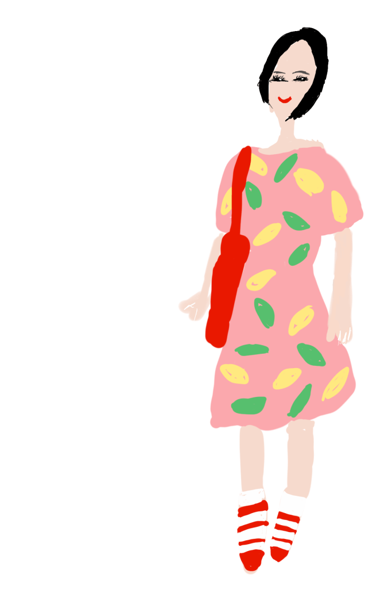
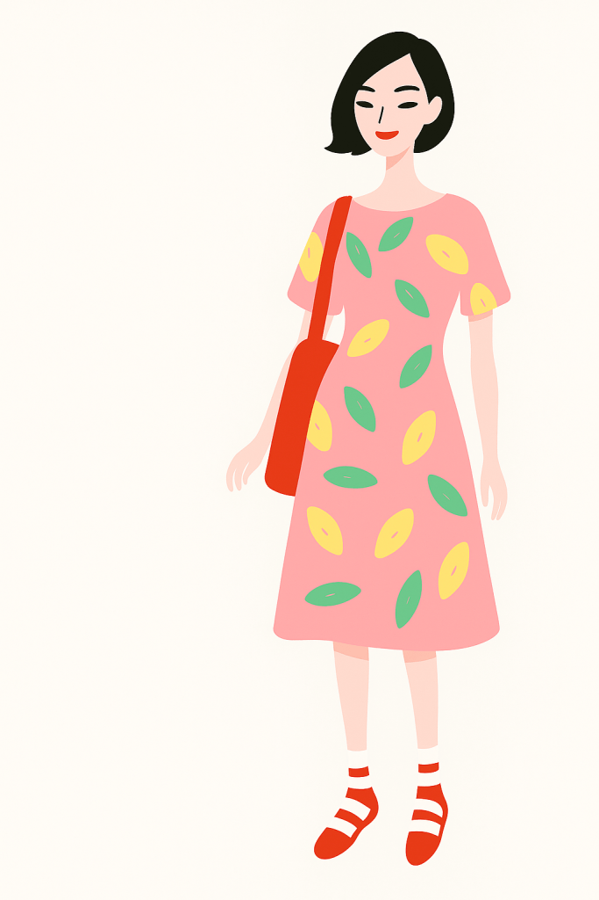
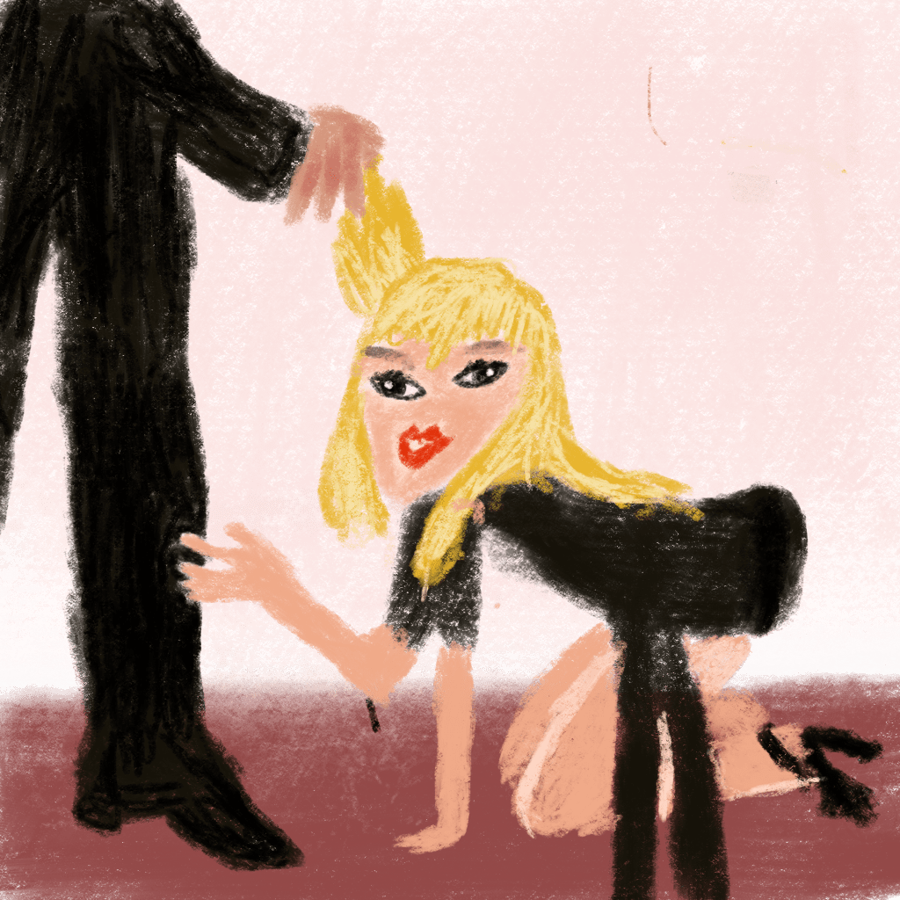
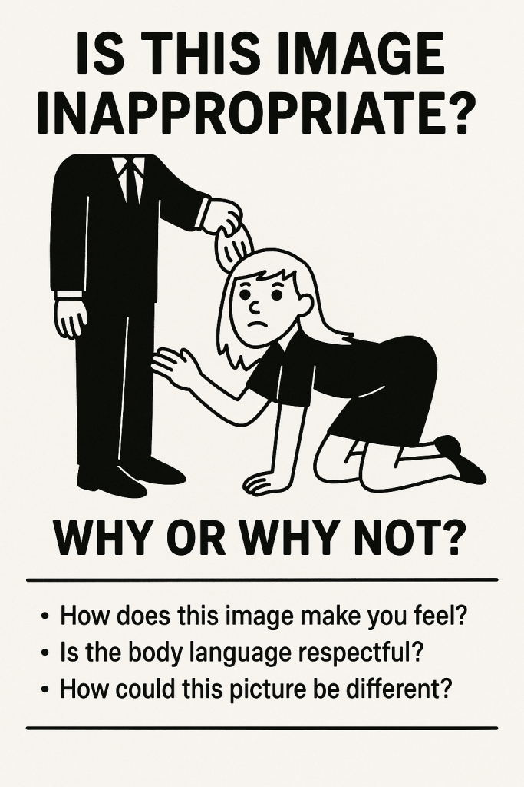

昨天用 Proecreate 畫了兩張圖，分別是 Sabrina Carpenter 新專輯封面，以及以朋友的照片為靈感。對我這個生手來說，效果已經算滿意了（標準很低），不過後來又請 ChatGPT 修改，蠻令人驚豔的。不過我丟粗稿，餵給 ChatGPT 出精稿，這樣還算是我的作品嗎？

另外一組 Sabrina Carpenter，ChatGPT 以內容政策為由拒絕修改圖片，不過提供了一版教育性的卡片，我覺得也不差。

[Sabrina Carperter 的原始專輯封面。](https://www.instagram.com/p/DKxDWGBxybt/)
