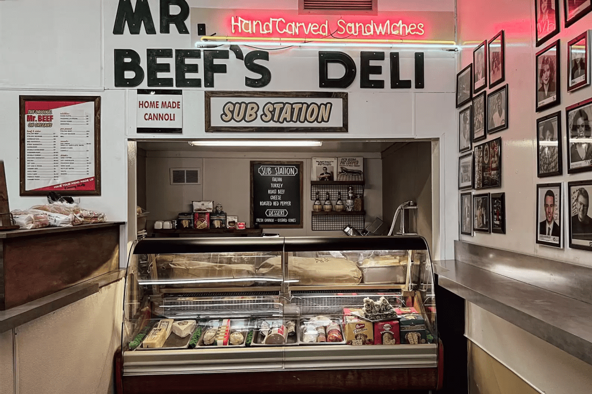

1. 一開始就是為了大熊餐廳開訂閱 Disney+ 但看得很沒勁，大概看了四集停滯，可能是一直在吵架。一個月後再看整個停不下來，一次看完八集，最後一集並且哭了。然後還立刻馬上開始重看。所謂會「想擁有」而不只是「看串流」就好的影集

3. 應該是第六集開頭的長鏡頭（？），一鏡直線到底把廚房裡全部成員的緊繃情緒

5. 有時看戲劇表演時，對話給我不太自然的感覺，只要有一個人開始講話，其他聲音全部都變靜音或背景音。但實際上一群人談話通常是破碎而又疊加的，這部影集就有把這件事情做好

7. 很喜歡裡面每個人都像一個人，都不太討人喜歡，都有些缺點，都會犯些超過「人之常情」的錯誤，其實也有些很誇張（一時想不起來），惹毛跟被惹毛是常態
    1. 主角當然不用說了，滿口 fuck 、五官抑鬱深邃但肌肉兇猛，有才華出於愛之匱乏，魅力十足。妹妹嘴巴鋒利愛指教，很喜歡這個設定。（我很愛有把討人厭特質演出來的女生，因為那會讓我覺得我差不多糟，或沒那麼糟）

9. Richie 這個 8+9 角色有義氣沒大腦，只會大聲咆哮，還會失控打死人，不懂說愛，我也很愛

11. 很喜歡，非常喜歡，哥哥、弟弟（主角）、妹妹、表哥一起做菜的那一幕

13. 最後一集，自殺的哥哥將成疊鈔票放置在罐頭裡，每個人都鬆了好大一口氣，沒錢真的不自由，支持基本收入

15. 噢，我愛芝加哥。但餐廳店面被開槍怎麼好像真的是日常，流氓聚眾滋事，也好似若無其事，出去安撫兩句就算了

17. 發生在廚房的各種令人爆炸的情景，真的拍得真的好好。牛肉三明治也好好吃，想再造訪芝加哥了。

補充：

10. 為何想看這部？海報美，故事吸引人，牛肉三明治看起來很美味，毛奇推薦
