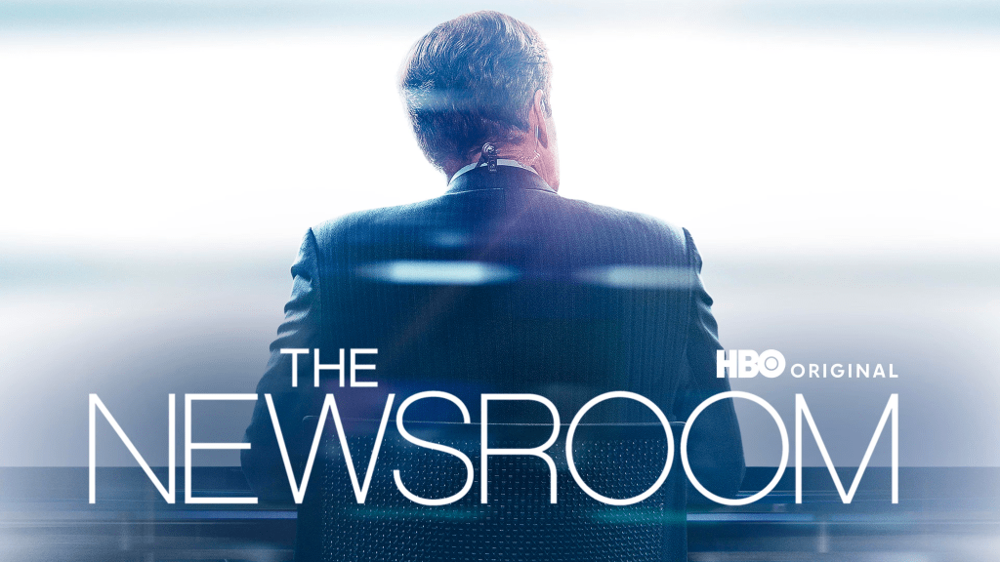

最近重看《新聞編輯室》，幾個有意思的情節：

1. 製作人把剛播完新聞的主播拉進會議室，問她「[你認為 corporate 跟 person 有什麼不同](https://www.hbo.com/the-newsroom/videos/the-newsroom-s1-ep-2-corporations-and-people-clip)？」主播說，「**如果是一個人，它會為你撐住門，如果是企業，它撐了門就會跟你要錢。**」

3. 歷經數年戰場記者經驗的製作人回到編輯室，準備大刀闊斧改革改革已經行之有年也是收視率保證的節目，它列出三條制定節目議題的準則：  
    ➊ 這個議題是我們投票時需要知道的事情嗎？  
    ➋ 這是最有效的形式嗎（這邊不太懂，是指該議題若有比以電視節目的形式呈現更好的方式，就不該以電視播送嗎？）  
    ➌ 這個議題一定要有歷史脈絡可循。  
    後來追加一條：這個議題應該會有正反兩面嗎？（比如說保守派今天宣布地球是平的，那就沒有討論空間）。

5. 其他還有一些好笑的台詞，比如說，「我掩護你，Meg 掩護我，Will 掩護 Meg，Charlie 掩護所有人」
