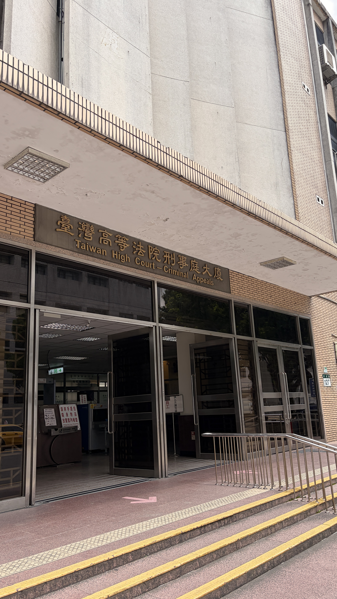

趁著無業期間，解鎖了法院旁聽的成就。

一直想親眼看看法庭是什麼樣子。這次去了北一女附近的台北地方法院，發現二、三樓都有法庭開庭，只要庭門開著，任何人都可以自由進去旁聽。

我從下午兩點一路待到五點，前後聽了六、七個案件。大多是詐欺案，另外還有一件疑似工傷調解，以及一件偽造文書案。由於每一庭都是中途才走進去，對案件的來龍去脈其實不太清楚，只能從法官、檢察官、律師和被告的對話，勉強拼湊事情樣貌。

有人站在被告席，大聲喊著：「我是無罪的，請法官還我清白。」一名緬甸僑生低著頭，表示自己真的無力償還欠款，帶著 LV 包包的律師幫忙補充，家裡的小吃店生意也差，真的無能為力；另一名戴著手銬的女子則請求審判長，希望不要把她押解回台中的看守所，讓她留在台北，方便奶奶和姊姊前來探視。也目睹一樁疑似是工殤的調解案，被告滿頭白髮的阿伯，一句不吭，委由律師回答，她說他已經盡力籌到 50 萬，真的無法再更多，請求諒解。

短短幾分鐘的庭訊，每個人都只說了幾句話，但背後都藏著一段我無從得知的人生。

其中印象最深的是一件數位貨幣詐欺案。法官當庭拿著被告提供的 Telegram 對話紀錄，一則一則核對內容。被告有三位律師陪同，全程神情輕鬆，旁聽席還坐著一位朋友，替他保管可能作為證物的手機。

Telegram 具有同時清除雙方訊息的功能，被告在對方刪除對話之前，先把其中一支手機切成飛航模式，保留下完整的聊天紀錄。法官接著比對兩支手機的內容，發現部分訊息並不一致，最後沒有繼續在庭上爭論，而是要求雙方再以書狀補充說明。

原本以為法庭上的攻防會像影集一樣精彩，實際旁聽後才發現，大部分時間都圍繞在程序本身。我這天下午聽到的案件幾乎都是上訴程序，法官確認上訴範圍、詢問檢察官意見、安排後續期日，真正激烈的辯論其實並不多。

另一個讓我印象深刻的，反而不是案件，而是書記官。

書記官幾乎整場都在高速打字，法官和律師還會不時停下來，要求修改措辭、補充內容或更正紀錄。光是在旁邊看，就能感受到這份工作的壓力。身為軟體業出身的人，我腦中一直冒出同一個問題：這是不是 AI 很適合協助的工作？

例如透過語音辨識先產生逐字稿，再由書記官校對、修正，或許能減少大量重複輸入的工作。不過司法程序講究的不只是速度，而是精確。一個字、一個標點，甚至一句話是否完整，都可能影響後續的認定。AI 如果辨識錯誤、遺漏內容，或無法判斷哪些內容應該被記錄，反而可能製造新的爭議。

另外，我原本以為法院每天都會有很多民眾旁聽，但現場其實安靜得出乎意料。多數法庭的旁聽席都只有我一個人。偌大的法庭裡，只有法官、檢察官、律師、書記官、被告，以及一位素不相識的旁聽者。

三個小時裡，我沒有看到電視劇裡精彩的法庭攻防，卻看見了司法系統日復一日的運作，也短暫旁觀了幾段陌生人的人生。

下次有機會，我想再找一場第一審、從頭到尾完整審理的案件，看看真正的法庭攻防究竟是什麼模樣。
